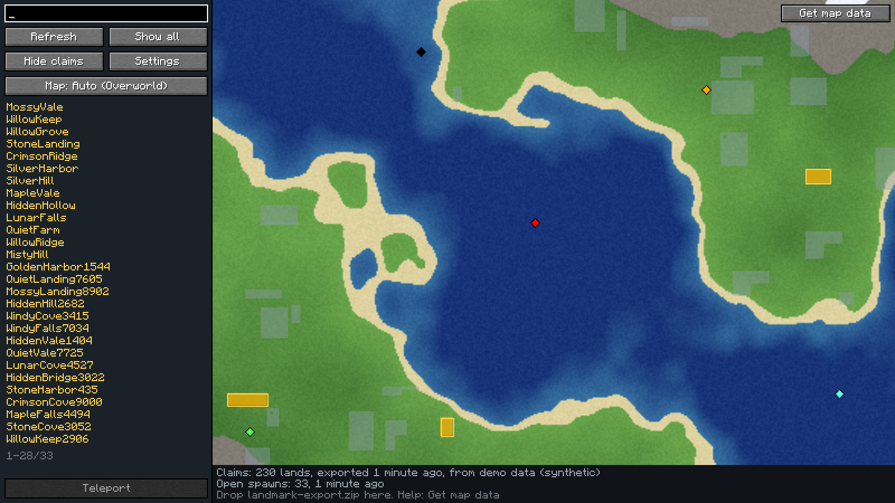
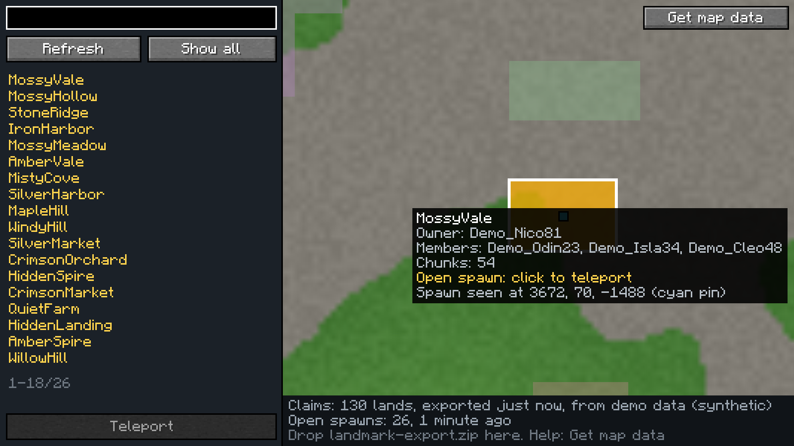
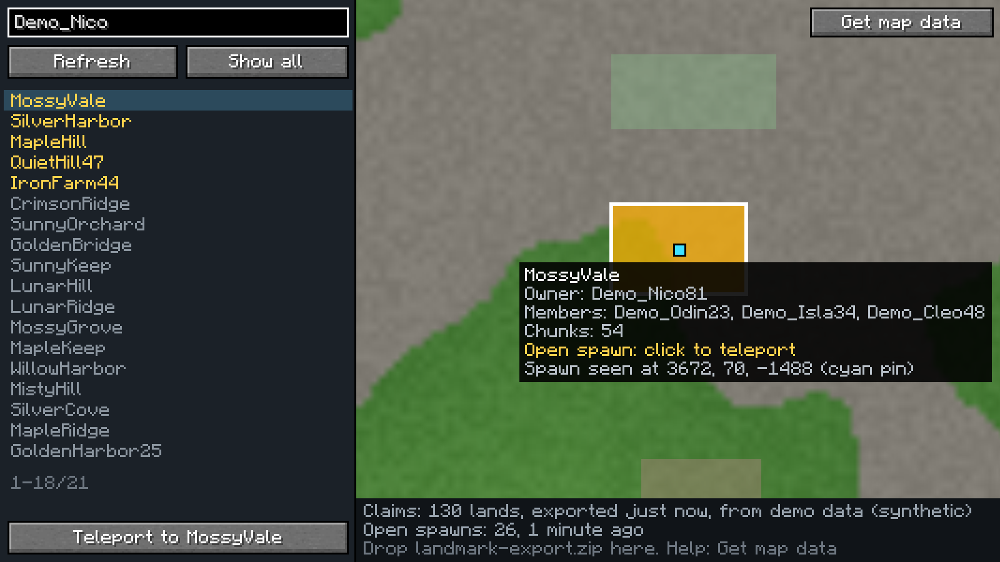
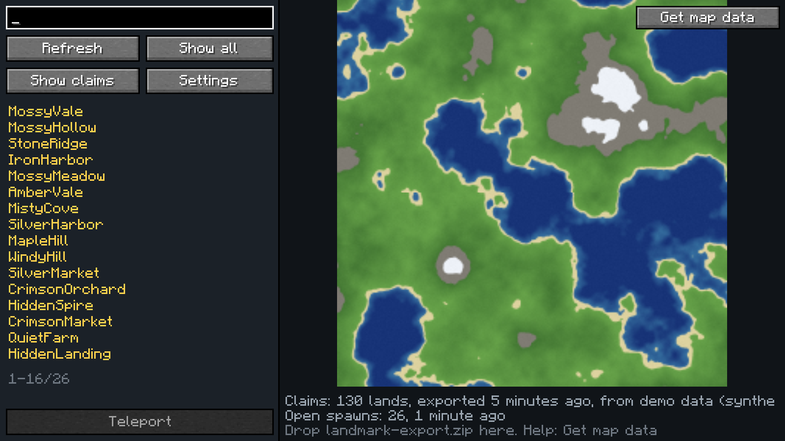
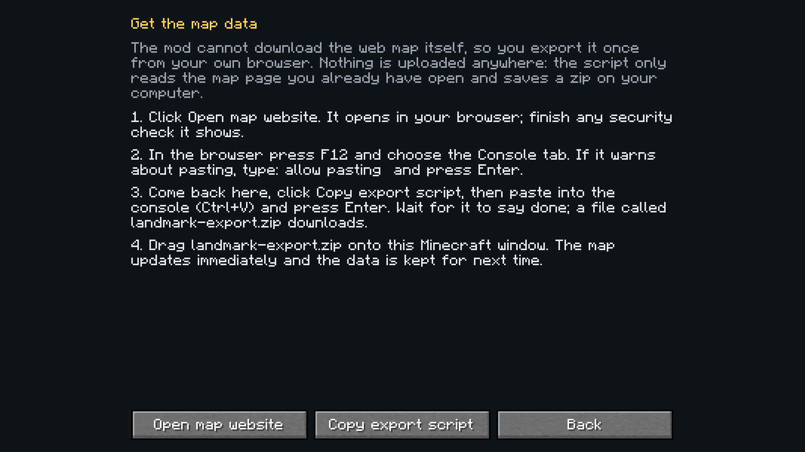
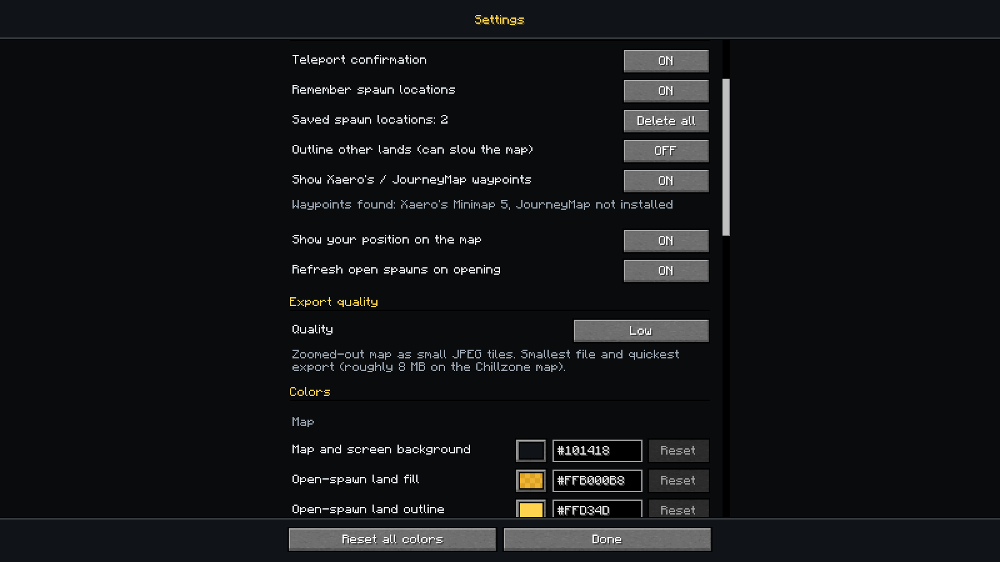
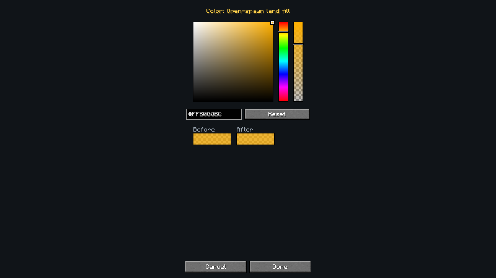

# Landmark

An in-game map of land claims for fast `/lands spawn <land>` teleporting. A client-side Fabric mod for Minecraft 26.2.

> Not affiliated with or endorsed by Chillzone or the Lands plugin.

Press `M` (rebindable) in a world to open the map. Lands that currently have a public spawn are highlighted. Click one,
confirm, and the mod runs `/lands spawn <name>` for you. That is all it does.

The screenshots in this README use synthetic data (fake lands, fake owners, generated terrain), made with
[`tools/make-demo-zip.js`](tools/make-demo-zip.js). They contain nothing from any real server.

## What it does

- A full-screen map you can pan and zoom, with a marker for yourself.
- Claims drawn over a zoomed-out terrain background. Lands with an open spawn are amber and outlined; the hovered and
  selected lands get their own outline.
- Hover a land for its owner, members, size and whether it has an open spawn.
- Search by land name, owner or member. Press **Refresh** to re-request the live open-spawn list.
- Click an amber land (or select one in the list and press Teleport), confirm, and you are on your way.
- **Hide claims** (button in the side panel) shows the bare terrain; it hides the claims and their spawn pins, and brings both back when you click it again.
- After you teleport, the mod remembers where you arrived and shows a cyan pin there, even for lands newer than your map
  data. Turn that off in Settings and the pins are hidden (and you can delete all of them there).
- Waypoints you made in **Xaero's Minimap** or **JourneyMap** show up as small diamonds in their own colour (hover for the name
  and position). On by default and optional; see below.
- It always tells you where its data comes from and how old it is.

## Install

Requires Minecraft 26.2, [Fabric Loader](https://fabricmc.net/) 0.19.5 or newer,
[Fabric API](https://modrinth.com/mod/fabric-api) and Java 25. Download the jar from the
[releases page](https://github.com/TrojanHorsePower/Landmark/releases) and put it in your `mods` folder. It only loads on the
client; nothing is needed on the server.

## Getting the map data

The server's own command suggestions give the mod the list of open spawns live, with no setup. The claim shapes, names and
terrain background come from the server's web map, which a program cannot read directly (it sits behind a browser check),
so you export it once from your own browser:

1. In the mod, open the map and press **Get map data**. It walks you through the steps and has buttons to open the web map
   and to copy the export script.
2. Run the script in the browser console on the map page. It saves `landmark-export.zip`.
3. Drag the zip onto the Minecraft window. You can do this right on the help page; there is no need to go back to the map
   first. The data is stored in your game folder (`landmark/`) and reused next time.

The copied script uses the **export quality** you chose in the settings (see below).

The script only reads the page you have open and saves a file on your computer. Nothing is uploaded, and the mod needs no
account, key or token. Re-export now and then if the claims on the server have changed; the map shows how old its data is.

## What works without what

| You have | You get |
|---|---|
| Nothing | A clear message, and you can still type an exact land name and teleport |
| The live open-spawn list (always available on the server) | A searchable list of open-spawn lands |
| Plus an imported export | The full map: claims, owners, highlights, terrain |
| Plus your own teleports | Cyan pins at spawn points the mod saw you arrive at, even for lands newer than your export |

Teleporting never depends on map or claim data. Claims are stored per dimension; only the overworld has data today, and
nothing is drawn in a dimension without data.

## Settings

Open them with the **Settings** button on the map, or from the mod's entry in [Mod Menu](https://modrinth.com/mod/modmenu) if you
have it (it is optional). Everything applies immediately.

- **Keybinds.** Click the key, press the new one (Esc cancels); if the key is already used the mod asks before binding it. It
  is the same setting as in Options > Controls, so it changes in both places.
- **Features.** Teleport confirmation, remembering spawn locations after you teleport (with a count and a Delete all button),
  showing Xaero's / JourneyMap waypoints, showing your own position on the map, refreshing the open-spawn list when the map
  opens, and an optional outline around every non-open land. That outline is off
  by default because with thousands of lands it can slow the map down (it cost about 3-6 ms per frame at some zoom levels on the
  real map, against under 1.5 ms without it); its colour is editable once you turn it on.
- **Export quality.** Decides what the copied export script fetches:

  | Preset | Map detail | Tile format | Roughly, on the Chillzone map |
  |---|---|---|---|
  | Low (default) | zoomed out | small JPEG | 8 MB |
  | Medium | zoomed out | full-quality PNG | 50 MB |
  | High | 2x the detail | full-quality PNG | 170 MB |
  | Ultra | 4x the detail | full-quality PNG | 600 MB or more (estimated) |

  Higher quality means larger file sizes on disk and longer export times. Only the tile detail and format change; the claims
  are identical in every preset. The mod picks the preset's values when it copies the script, so change it before copying.
- **Colors.** Every color the mod draws with: a picker plus a hex box that always match (`#RRGGBB`, or `#RRGGBBAA` for colors
  with opacity), a Reset for each color, and a Reset all.

`config/landmark.json` holds the same settings (created on first save):

| Key | Default | Meaning |
|---|---|---|
| `confirmTeleport` | `true` | Ask before running `/lands spawn` |
| `saveSpawns` | `true` | Remember where you arrive after a teleport and show a pin there |
| `showExternalWaypoints` | `true` | Show waypoints from Xaero's Minimap and JourneyMap |
| `showPlayerMarker` | `true` | Show your own position on the map |
| `outlineOtherLands` | `false` | Outline lands that are not open-spawn (can slow the map down) |
| `refreshOnOpen` | `true` | Request the open-spawn list when the map opens |
| `exportQuality` | `low` | `low`, `medium`, `high` or `ultra` (see above) |
| `colors` | `{}` | Colors you changed, by name, as hex; anything not listed uses its default |
| `mapUrl` | `https://map.chillzone.cc/` | The web map the help screen opens (https only) |
| `tileCacheSize` | `48` | Detail map tiles kept in memory (8 to 512; grows to fit what is on screen) |

## Waypoints from Xaero's Minimap and JourneyMap

If you use either mod, the waypoints you made there appear on Landmark's map. Nothing to set up:

- **JourneyMap** is read through JourneyMap's own plugin API, so it needs no files and works with the version you have.
- **Xaero's Minimap** has no API, so Landmark reads its waypoint files from your game folder
  (`xaero/minimap/Multiplayer_<server>/`). Only the folder for the server you are connected to is read, and only waypoints
  that are switched on in Xaero's. The server folder is matched by address, so if you joined with an unusual address and no
  waypoints appear, that is the first thing to check.
- Waypoints stay visible when you hide claims, because they are not claims. Colours come from the other mod. Settings shows how
  many were found from each source, and you can turn the whole thing off there.

Both are read-only: Landmark never changes or uploads your waypoints. Neither mod is required, and none of their code is
included in Landmark.

## Privacy

Everything stays on your computer: imported data (`landmark/` in the game folder), learned spawn points
(`landmark/learned-spawns.json`) and settings. Your Xaero's / JourneyMap waypoints are only read, never changed or sent anywhere. The mod makes no network requests of its own. The only thing it sends to the
server is the `/lands spawn` command you confirm, plus the same suggestion request the chat box makes when you type
`/lands spawn `.

## Building

Requires Java 25.

    ./gradlew build        # jar in build/libs, runs the JUnit tests
    node --test tools/export.test.js

The pure logic (parsing, codec, import, search, map math) has no Minecraft dependency and is unit-tested; see `src/test`.
How the export zip is laid out: [docs/export-format.md](docs/export-format.md).

## For a new maintainer

- **The name.** The display name lives in `Branding.java`, `fabric.mod.json` (`name`), `assets/landmark/lang/en_us.json`
  (keybind labels) and this README. The mod id `landmark` and the package name are internal; renaming them is optional.
- **Server specifics.** The only server-specific values are the default `mapUrl` in `LandmarkConfig.java` and the
  `/lands spawn` command in `MapScreen.java` / `LiveSpawns.java`.
- **CI and releases.** `.github/workflows/build.yml` builds and tests every push. `release.yml` runs when you push a tag
  `vX.Y.Z` that matches `mod_version` in `gradle.properties`, and attaches the jar to a GitHub release. It uses only the
  built-in `GITHUB_TOKEN`; no secrets or personal accounts are involved.
- **Updating when Minecraft updates.** Bump the versions in `gradle.properties` (see https://fabricmc.net/develop) and fix
  whatever the compiler reports; the client code uses Mojang's real names.
- **Waypoint integrations.** `XaeroWaypoints` (pure, tested) parses Xaero's files; `LandmarkJourneyMapPlugin` is loaded by
  JourneyMap through the `journeymap` entrypoint and `JourneyMapReader` uses its API. The JourneyMap API is a `compileOnly`
  dependency and is never bundled (its licence allows using it as a dependency, not shipping it). Neither mod is bundled or
  required.
- **Settings and Mod Menu.** `ConfigScreen` is the settings screen; `LandmarkModMenu` registers it with Mod Menu, which is an
  optional, compile-time-only dependency (the mod runs without it). Colors are defined once in `ColorKey` and read through
  `Palette`; to add a color, add it to `ColorKey` and give it a label in `lang/en_us.json` (a test fails if one is missing).
- **The export script** is `tools/export.js`. It is bundled into the jar and copied to the clipboard by the help screen, so
  there is one copy. If the web map's data format ever changes, update it and `Pl3xLandsParser`.
- **Demo data and screenshots.** `node tools/make-demo-zip.js demo.zip` builds a fake export. In a Fabric dev environment,
  `-Dlandmark.dev.demo=1` opens the map from the title screen with that data and saves screenshots to the run folder, so the
  screen can be checked without joining a server. It does nothing in a normal game.
  Add `-Dlandmark.dev.layout=1` to visit every screen and screenshot it at the current window size; Minecraft never makes the
  GUI smaller than 320x240, so run it at `--width 640 --height 480` with `guiScale:2` in `run/options.txt` to check the worst case. `node tools/make-icon.js` regenerates
  the icon.

## About this project

Landmark was written with the help of Claude Code, an AI coding assistant, and is tested and reviewed by its maintainer.
The unit tests, the CI build, and checks against a real game client are what the code is verified by.

## License

[MIT](LICENSE). Not affiliated with or endorsed by Chillzone or the Lands plugin; no game assets, server data or third-party
code is bundled.
